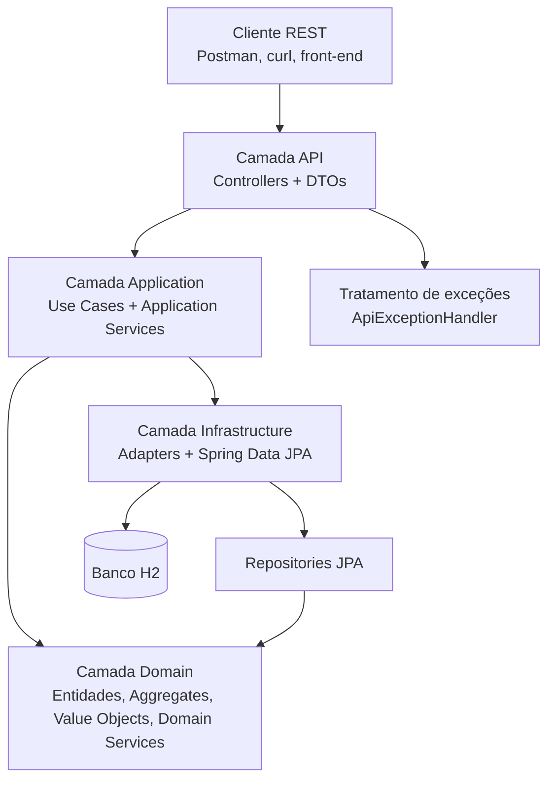
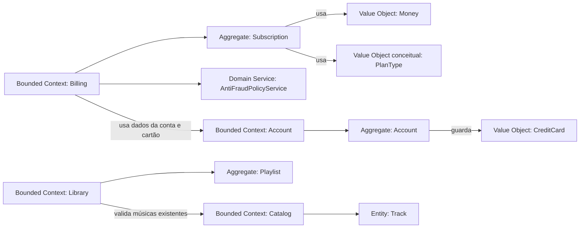

# Music Streamer API

API REST de um streamer de música inspirada em plataformas como Spotify, construída com Spring Boot, Maven, H2, DDD e regras antifraude.

## Pré-requisitos

- Java 21
- Maven 3.9+

## Como rodar

```bash
mvn spring-boot:run
```

A aplicação será iniciada em `http://localhost:8080`.

## Como executar os testes

```bash
mvn test
```

## Banco H2

- Console: `http://localhost:8080/h2-console`
- JDBC URL: `jdbc:h2:mem:musicstreamer`
- Usuário: `sa`
- Senha: deixar em branco

## Endpoints principais

- `POST /accounts` cria uma conta
- `POST /accounts/{accountId}/cards` cadastra ou atualiza o cartão
- `POST /accounts/{accountId}/subscriptions` ativa uma assinatura
- `POST /transactions/authorizations` autoriza uma transação com antifraude
- `POST /tracks` cadastra uma música
- `POST /accounts/{accountId}/favorites/{trackId}` favorita uma música
- `GET /accounts/{accountId}/favorites` lista músicas favoritas
- `POST /accounts/{accountId}/playlists` cria uma playlist
- `POST /accounts/{accountId}/playlists/{playlistId}/tracks/{trackId}` adiciona música à playlist
- `GET /accounts/{accountId}/playlists` lista playlists

## Regras antifraude implementadas

- O usuário pode ter somente um plano ativo
- O usuário deve ter um cartão de crédito válido
- Nenhuma transação é aceita quando o cartão não está ativo
- Não pode haver mais de 3 transações em um intervalo de 2 minutos
- Não pode haver mais de 2 transações semelhantes em um intervalo de 2 minutos

## Diagrama de arquitetura



Explicação:

- A camada `api` recebe as requisições HTTP e transforma entrada e saída em DTOs.
- A camada `application` orquestra os casos de uso, como criação de conta, assinatura, favoritos e autorização de transações.
- A camada `domain` concentra as regras de negócio e os conceitos principais do sistema.
- A camada `infrastructure` implementa persistência e integra os contratos do domínio com JPA e H2.

## Diagrama DDD



Explicação:

- `Account` representa a conta do usuário e os dados do cartão.
- `Billing` cuida de assinatura, transações e regras antifraude.
- `Catalog` representa o catálogo de músicas disponíveis.
- `Library` cuida de favoritos e playlists do usuário.

## Decisões de modelagem

Este projeto foi estruturado com foco em organização, evolução e clareza de responsabilidades. A separação entre `api`, `application`, `domain` e `infrastructure` ajuda a reduzir acoplamento e facilita manutenção, testes e futuras extensões. Dentro dessa estrutura, o padrão `Repository` foi utilizado para desacoplar o domínio da persistência, enquanto as interfaces de caso de uso deixam explícita a intenção de cada operação da aplicação.

Os princípios `SOLID` aparecem principalmente na separação de responsabilidades entre controllers, serviços de aplicação, domínio e persistência. Cada camada possui um papel bem definido, e os contratos por interface ajudam a manter baixo acoplamento e favorecer substituição e evolução dos componentes. A lógica antifraude, por exemplo, foi isolada em um `Domain Service`, evitando espalhar regras críticas pela camada de entrada HTTP.

No ponto de vista de DDD, o sistema foi dividido em subdomínios e bounded contexts: `Account`, `Billing`, `Catalog` e `Library`. O subdomínio principal é `Billing`, por concentrar as regras de assinatura e antifraude, que representam a parte mais crítica do problema. `Account` e `Library` atuam como subdomínios de suporte, enquanto `Catalog` pode ser visto como um subdomínio mais genérico, responsável por disponibilizar músicas para uso pelos demais contextos.

No design tático, foram utilizados `Entities`, `Value Objects`, `Aggregates`, `Repositories` e `Domain Services`. `Account`, `Subscription` e `Playlist` funcionam como aggregates com identidade própria baseada em `UUID`. Já `CreditCard` e `Money` representam value objects do domínio. A linguagem utilizada no código e na API busca refletir os conceitos do problema, como conta, assinatura, cartão, playlist, música favorita, autorização e violações antifraude, reforçando a Linguagem Ubíqua do projeto.

Em relação ao Context Map, `Billing` depende de informações de `Account` para validar cartão e elegibilidade da assinatura, enquanto `Library` depende de `Catalog` para validar a existência de músicas. Essas relações foram tratadas por contratos internos e serviços da aplicação, o que representa uma integração controlada entre contextos e facilita a evolução do sistema sem misturar responsabilidades.
