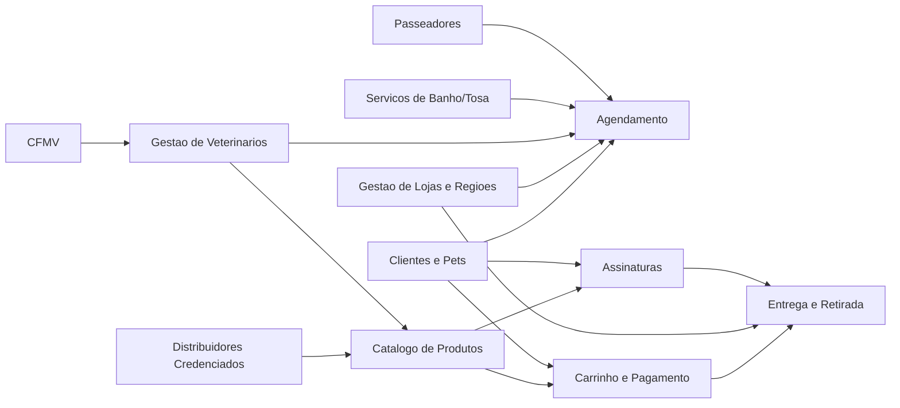
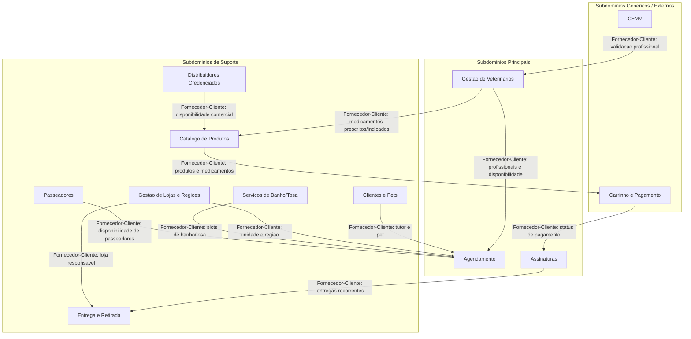
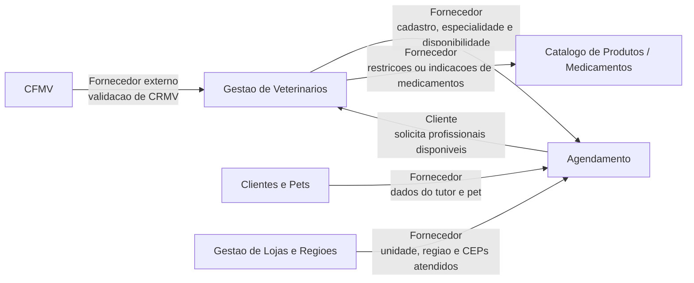

# Pet Friends - TP3 DR2

## Lista hipotética de Bounded Contexts

| Bounded Context | Subdomínio | Classificação | Justificativa |
|---|---|---|---|
| Gestão de Veterinários | Cadastro, validação e gestão dos profissionais veterinários | Principal | É o foco do TP3 e uma funcionalidade estratégica para a oferta de serviços de saúde animal. Envolve regras específicas, como conselho regional, especialidade, disponibilidade e validação junto ao CFMV. |
| Agendamento | Marcação de consultas, banho/tosa, passeios e demais serviços | Principal | É essencial para a experiência do cliente e para a operação dos serviços. Conecta clientes, profissionais, unidades e disponibilidade. |
| Conselho Federal de Medicina Veterinária | Validação externa dos registros profissionais | Genérico | É um sistema externo e regulatório, não controlado pela Pet Friends. A empresa consome seus dados para validar veterinários. |
| Gestão de Lojas e Regiões | Cadastro das lojas, regiões atendidas e CEPs | Suporte | Apoia a operação, determinando qual unidade atende o cliente e quais profissionais ou serviços estão disponíveis por região. |
| Clientes e Pets | Cadastro de tutores e seus animais | Suporte | Fornece dados necessários para consultas, assinaturas e serviços, mas não é o diferencial principal do domínio de veterinários. |
| Serviços de Banho/Tosa | Gestão dos serviços e slots de atendimento | Suporte | Relevante para a operação de serviços, mas com regras específicas diferentes das consultas veterinárias. |
| Passeadores | Cadastro, disponibilidade e avaliação de passeadores | Suporte | Apoia uma linha de serviço específica, relacionada a passeios, mas separada da gestão veterinária. |
| Catálogo de Produtos | Definição de produtos, categorias e medicamentos | Suporte | Apoia o e-commerce e pode se relacionar com veterinários no caso de medicamentos, mas não é o foco principal. |
| Carrinho e Pagamento | Compra de produtos e pagamento de serviços | Genérico | Regras de carrinho, checkout e pagamento são comuns em sistemas comerciais e podem usar soluções padronizadas. |
| Assinaturas | Pacotes recorrentes de ração, produtos e serviços | Principal | Representa um diferencial de negócio da Pet Friends, com regras próprias de recorrência, composição de pacote e periodicidade. |
| Entrega e Retirada | Entrega por loja regional ou retirada em unidade | Suporte | Apoia a venda de produtos e assinaturas, usando a loja responsável pela região do cliente. |
| Distribuidores Credenciados | Cadastro de fornecedores e produtos disponíveis | Suporte | Apoia a venda de produtos, mas depende de regras comerciais e integração com parceiros. |

## Visão geral dos Bounded Contexts

## Mapa de Contexto

O contexto de **Gestão de Veterinários** se relaciona obrigatoriamente com o contexto de **Agendamento** e com o sistema externo do **Conselho Federal de Medicina Veterinária**. A proposta abaixo prioriza relacionamentos do tipo **Fornecedor-Cliente**, conforme solicitado no enunciado.

## Relações envolvendo Gestão de Veterinários

## Estratégias de comunicação e integração

### Gestão de Veterinários e Agendamento

- **Tipo de relacionamento:** Fornecedor-Cliente.
- **Fornecedor:** Gestão de Veterinários.
- **Cliente:** Agendamento.
- **Estratégia:** disponibilizar APIs para consulta de veterinários ativos, especialidades, unidade de atendimento e horários disponíveis.
- **Comunicação sugerida:** REST síncrono para consultas em tempo real e eventos assíncronos para mudanças de disponibilidade.
- **Eventos possíveis:** `VeterinarioCadastrado`, `VeterinarioAtualizado`, `DisponibilidadeAlterada`, `VeterinarioInativado`.
- **Justificativa:** o Agendamento depende de informações atualizadas para permitir que o cliente marque consulta com um profissional específico ou com o primeiro disponível.

### Gestão de Veterinários e CFMV

- **Tipo de relacionamento:** Fornecedor-Cliente com sistema externo e Anticorruption Layer.
- **Fornecedor:** Conselho Federal de Medicina Veterinária.
- **Cliente:** Gestão de Veterinários.
- **Estratégia:** criar uma camada anticorrupção para proteger o modelo interno da Pet Friends contra mudanças no formato de dados ou regras da integração externa.
- **Comunicação sugerida:** API externa síncrona para validação inicial e revalidação periódica por processo assíncrono.
- **Dados validados:** número do conselho regional, situação cadastral, nome profissional, UF, especialidade quando disponível.
- **Justificativa:** o CFMV é uma entidade externa e regulatória; a Pet Friends não deve acoplar diretamente seu modelo interno ao modelo do conselho.

### Gestão de Veterinários e Clientes/Pets

- **Tipo de relacionamento:** Fornecedor-Cliente indireto via Agendamento.
- **Fornecedor:** Clientes e Pets.
- **Cliente:** Agendamento e, indiretamente, Veterinários.
- **Estratégia:** manter o contexto de Veterinários focado em profissionais, evitando absorver regras de cadastro de tutores e animais.
- **Comunicação sugerida:** o Agendamento consolida os dados necessários para a consulta.
- **Justificativa:** veterinários precisam atender pets, mas o domínio de cadastro e manutenção dos animais pertence a outro contexto.

### Gestão de Veterinários e Gestão de Lojas/Regiões

- **Tipo de relacionamento:** Fornecedor-Cliente.
- **Fornecedor:** Gestão de Lojas e Regiões.
- **Cliente:** Gestão de Veterinários e Agendamento.
- **Estratégia:** associar veterinários às lojas ou regiões onde atuam, usando dados fornecidos pelo contexto de lojas.
- **Comunicação sugerida:** consulta síncrona para validação de loja/região e eventos para alterações de cobertura.
- **Eventos possíveis:** `LojaCadastrada`, `LojaInativada`, `RegiaoDeAtendimentoAlterada`.
- **Justificativa:** a disponibilidade dos veterinários e a marcação de consultas dependem da região e da loja responsável pelo atendimento.

### Gestão de Veterinários e Catálogo de Produtos/Medicamentos

- **Tipo de relacionamento:** Fornecedor-Cliente.
- **Fornecedor:** Gestão de Veterinários.
- **Cliente:** Catálogo de Produtos, principalmente no subgrupo de medicamentos.
- **Estratégia:** expor informações ou eventos relacionados a prescrições, restrições e medicamentos que exigem validação veterinária.
- **Comunicação sugerida:** eventos de domínio e APIs específicas para consulta de elegibilidade quando necessário.
- **Justificativa:** medicamentos são citados no enunciado como um grupo específico de produtos que pode conversar com o módulo de veterinários.

## Hipóteses adotadas

- A Gestão de Veterinários é tratada como subdomínio principal por ser o foco do TP3 e por conter regras de negócio relevantes.
- O CFMV é considerado contexto externo e genérico, pois atua como autoridade regulatória fora do controle da Pet Friends.
- O Agendamento é um subdomínio principal, pois coordena serviços essenciais da experiência do cliente.
- A relação entre Veterinários e Agendamento usa Fornecedor-Cliente, com Veterinários fornecendo dados profissionais e disponibilidade.
- A relação entre Veterinários e CFMV usa Anticorruption Layer para evitar dependência direta do modelo externo.
- O Catálogo de Produtos se relaciona com Veterinários apenas em casos ligados a medicamentos, prescrições ou restrições.

## Conclusão

O contexto de Gestão de Veterinários deve manter um modelo próprio para cadastro, validação profissional, especialidades e disponibilidade. Ele atua como fornecedor para o Agendamento, que depende desses dados para oferecer consultas aos clientes, e como cliente do CFMV, consumindo validações oficiais dos registros profissionais.

Essa separação favorece baixo acoplamento entre equipes, preserva a autonomia dos Bounded Contexts e permite evoluir a solução para o AT com maior clareza sobre responsabilidades, integrações e fronteiras de domínio.
