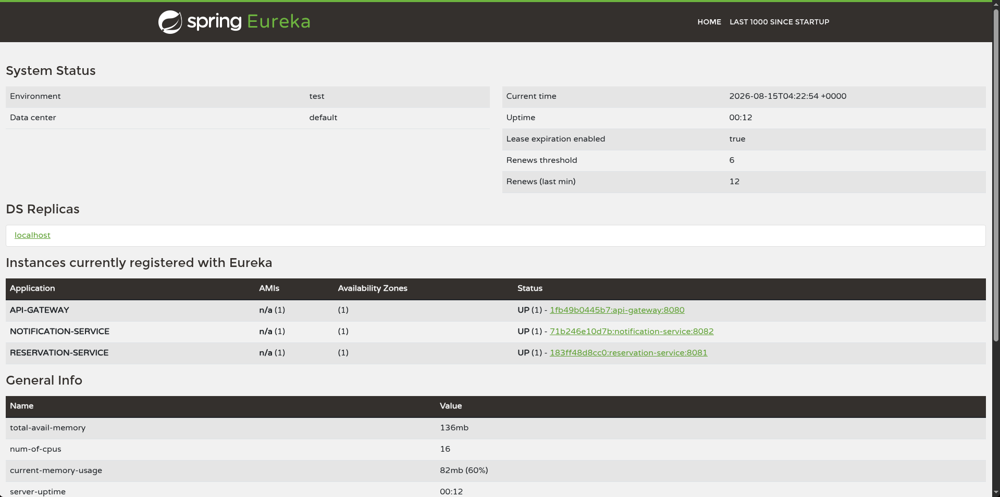
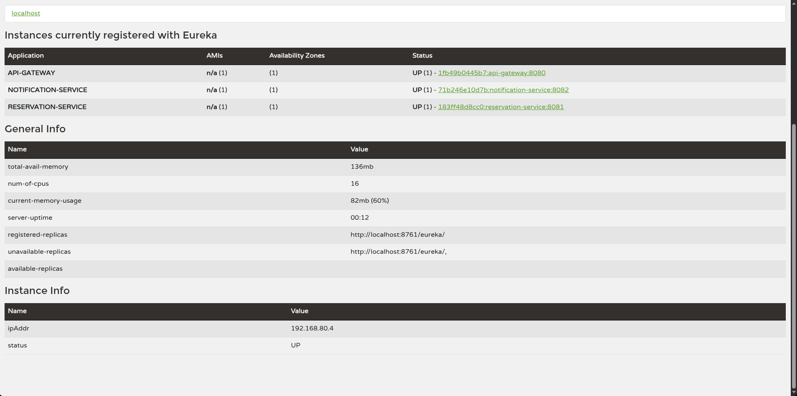

# Evidências de execução

## Serviços registrados no Eureka

A interface do Eureka, disponível em `http://localhost:8761`, mostra `API-GATEWAY`, `RESERVATION-SERVICE` e `NOTIFICATION-SERVICE` com status `UP`.





## Chamada pelo API Gateway

Exemplo de requisição pelo Gateway:

```bash
curl -X POST http://localhost:8080/api/reservations \
  -H 'Content-Type: application/json' \
  -d '{"roomName":"Sala Atlântico","requesterEmail":"guilherme@example.com","startsAt":"2026-09-01T10:00:00","endsAt":"2026-09-01T11:00:00"}'
```

Exemplo de resposta:

```json
{"id":1,"roomName":"Sala Atlântico","requesterEmail":"guilherme@example.com","startsAt":"2026-09-01T10:00:00","endsAt":"2026-09-01T11:00:00","status":"CONFIRMED"}
```

Depois disso, `GET http://localhost:8080/api/notifications` lista a notificação de confirmação destinada a `guilherme@example.com`. Isso mostra a comunicação entre os serviços e o registro da mensagem no MongoDB.
