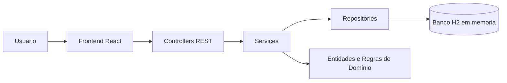
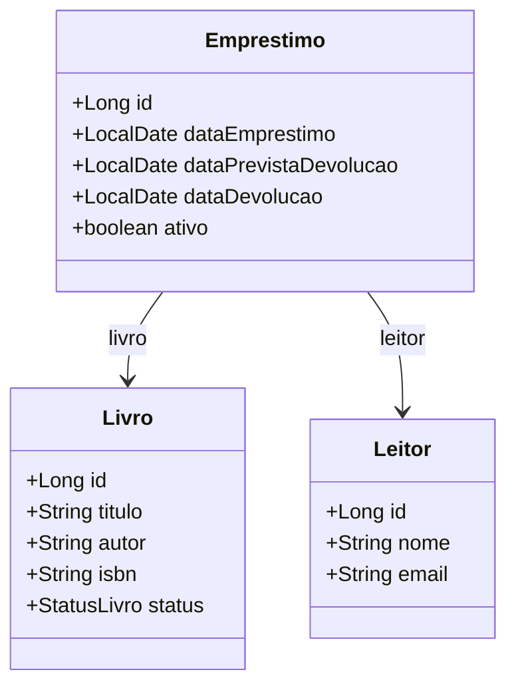
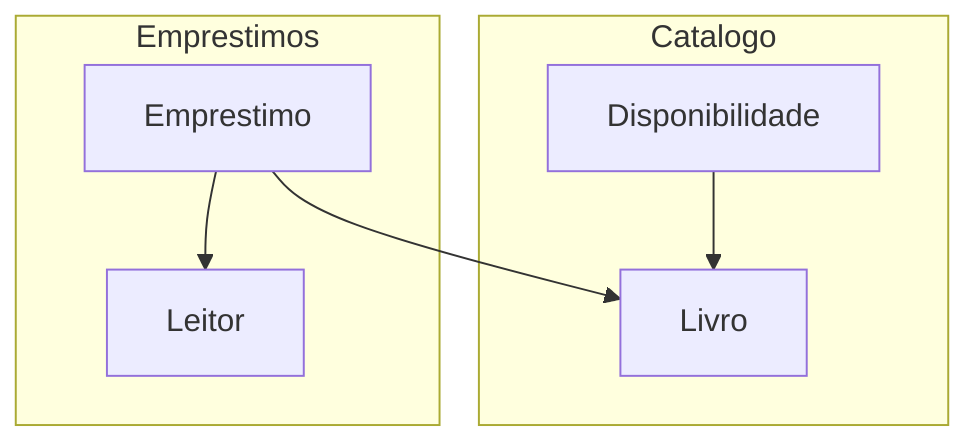

# Sistema de Biblioteca

Aplicação monolítica para gerenciamento de biblioteca, com backend em Spring Boot e frontend em React.

## Visão Geral

O sistema foi organizado em duas partes:

- `backend/`: API REST responsável pelas regras de negócio e persistência
- `frontend/`: interface web para cadastro e consulta de dados

As principais funcionalidades implementadas são:

- CRUD de livros
- CRUD de leitores
- Registro de empréstimos
- Registro de devoluções
- Listagem de livros disponíveis

## Arquitetura

A solução segue uma arquitetura simples em camadas no backend:

- `controller`: recebe as requisições HTTP
- `service`: aplica as regras de negócio
- `repository`: acessa os dados com Spring Data JPA
- `model`: representa as entidades do domínio
- `dto`: organiza os dados de entrada e saída da API

No frontend, o React consome os endpoints REST e apresenta as informações em uma interface única.



## Modelagem do Domínio

O domínio principal é `Biblioteca`, dividido de forma simples em dois subdomínios:

- `Catálogo`: gerenciamento de livros
- `Circulação`: empréstimos e devoluções

As entidades principais são:

- `Livro`
- `Leitor`
- `Emprestimo`

Regras de negócio centrais:

- um livro só pode ser emprestado se estiver disponível
- ao registrar um empréstimo, o status do livro muda para `EMPRESTADO`
- ao registrar uma devolução, o status do livro volta para `DISPONIVEL`
- um leitor com empréstimo ativo não pode ser removido



## Bounded Contexts

Para a primeira entrega, a modelagem foi mantida simples, mas já com separação conceitual inspirada em DDD:

- `Catálogo`: responsável por livros e disponibilidade
- `Empréstimos`: responsável por circulação, retirada e devolução



## Estrutura de Pastas

```text
TP1/
|-- backend/
|   |-- src/main/java/com/example/biblioteca/
|   |   |-- config/
|   |   |-- controller/
|   |   |-- dto/
|   |   |-- model/
|   |   |-- repository/
|   |   `-- service/
|   `-- src/main/resources/
|-- frontend/
|   |-- src/
|   |   |-- components/
|   |   `-- services/
|   `-- public/
`-- README.md
```

## Como Executar

### Backend

```bash
cd backend
mvn spring-boot:run
```

A API ficará disponível em `http://localhost:8080`.

### Frontend

```bash
cd frontend
npm install
npm run dev
```

O frontend ficará disponível em `http://localhost:5173`.

## Tecnologias Utilizadas

- Java 21
- Spring Boot
- Spring Web
- Spring Data JPA
- H2 Database
- React
- Vite

