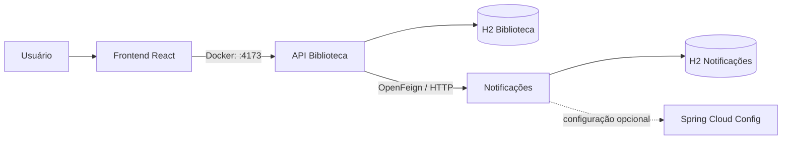
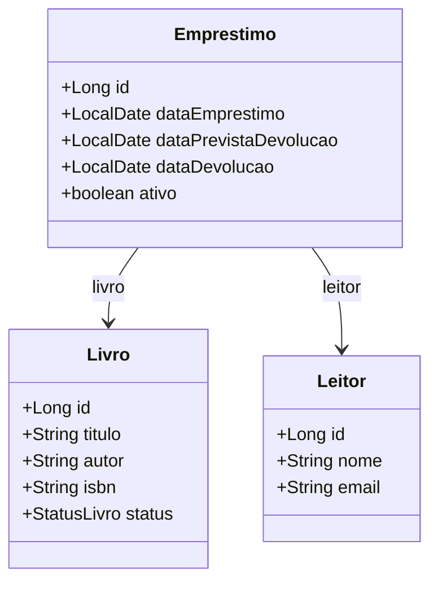
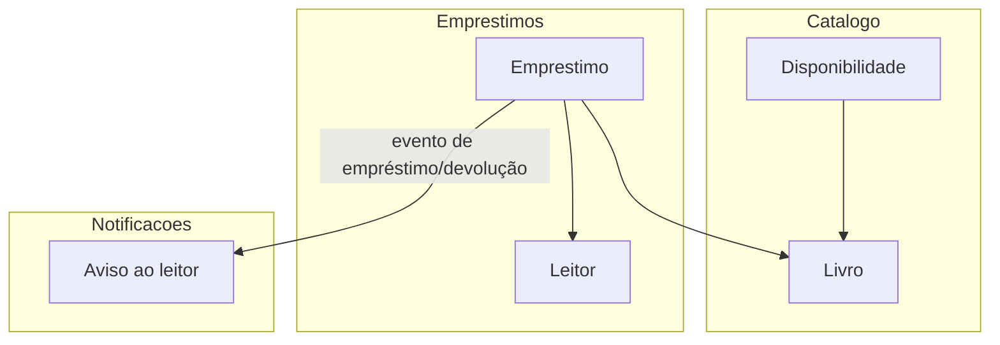

# Sistema de Biblioteca

Evolução da aplicação de biblioteca das etapas anteriores. O núcleo continua responsável por catálogo, leitores e circulação; o contexto de notificações foi extraído para um microsserviço independente.

## Visão Geral

O sistema foi organizado em três aplicações:

- `backend/`: API REST principal, regras de negócio e persistência do núcleo
- `frontend/`: interface web para cadastro e consulta de dados
- `notificacoes-service/`: microsserviço Spring Boot responsável pelas notificações

As principais funcionalidades implementadas são:

- CRUD de livros
- CRUD de leitores
- Registro de empréstimos
- Registro de devoluções
- Listagem de livros disponíveis
- Registro e consulta de notificações de empréstimo e devolução

## Arquitetura e integração

A solução segue uma arquitetura simples em camadas no backend:

- `controller`: recebe as requisições HTTP
- `service`: aplica as regras de negócio
- `repository`: acessa os dados com Spring Data JPA
- `model`: representa as entidades do domínio
- `dto`: organiza os dados de entrada e saída da API

O frontend React usa somente a API principal. Ao registrar um empréstimo ou uma devolução, o backend chama o microsserviço por Spring Cloud OpenFeign. O microsserviço tem aplicação Spring Boot, repositório Spring Data JPA e banco H2 próprios. A propriedade `spring.config.import` prepara o serviço para configuração distribuída com Spring Cloud Config.



## Modelagem do Domínio

O domínio principal é `Biblioteca`, dividido de forma simples em dois subdomínios:

- `Catálogo`: gerenciamento de livros
- `Circulação`: empréstimos e devoluções

As entidades principais são:

- `Livro`
- `Leitor`
- `Emprestimo`

Regras de negócio centrais:

- um livro só pode ser emprestado se estiver disponível
- ao registrar um empréstimo, o status do livro muda para `EMPRESTADO`
- ao registrar uma devolução, o status do livro volta para `DISPONIVEL`
- um leitor com empréstimo ativo não pode ser removido



## Bounded Contexts

Nesse terceiro TP, a modelagem evoluiu para separar o contexto de notificações em um microsserviço próprio:

- `Catálogo`: responsável por livros e disponibilidade
- `Empréstimos`: responsável por circulação, retirada e devolução
- `Notificações`: responsável pelo histórico de avisos aos leitores; é o bounded context extraído para outro serviço



## Estrutura de Pastas

```text
TP3/
|-- backend/
|   |-- src/main/java/com/example/biblioteca/
|   |   |-- config/
|   |   |-- controller/
|   |   |-- dto/
|   |   |-- model/
|   |   |-- repository/
|   |   `-- service/
|   `-- src/main/resources/
|-- frontend/
|   |-- src/
|   |   |-- components/
|   |   `-- services/
|   `-- public/
|-- notificacoes-service/
|   |-- src/
|   |-- pom.xml
|   `-- README.md
`-- README.md
```

## Como Executar

### Com Docker Compose

Na pasta `TP3`, execute:

```bash
docker compose up --build
```

| Serviço | Endereço externo | Papel |
| --- | --- | --- |
| Frontend | `http://localhost:4173` | Interface web em React. |
| Backend | `http://localhost:8180` | API REST principal. |
| Notificações | `http://localhost:8181` | API REST do microsserviço. |

O frontend encaminha suas chamadas `/api` internamente ao backend. O backend, por sua vez, usa a rede interna do Compose para chamar `http://notificacoes-service:8081` via OpenFeign. Os bancos H2 ficam em volumes Docker separados e são preservados entre reinicializações.

### Execução local (sem Docker)

Use três terminais, nesta ordem.

**1. Microsserviço de notificações**

```bash
cd notificacoes-service
mvn spring-boot:run
```

Ele ficará disponível em `http://localhost:8081`.

**2. Backend principal**

```bash
cd backend
mvn spring-boot:run
```

A API ficará disponível em `http://localhost:8080`.

**3. Frontend**

```bash
cd frontend
npm install
npm run dev
```

O frontend ficará disponível em `http://localhost:5173`.

## Endpoints adicionados

| Aplicação | Método | Endpoint | Descrição |
| --- | --- | --- | --- |
| Notificações | `POST` | `/api/notificacoes` | Cria um aviso recebido da Biblioteca. |
| Notificações | `GET` | `/api/notificacoes/leitor/{leitorId}` | Retorna os avisos de um leitor. |
| Biblioteca | `GET` | `/api/leitores/{leitorId}/notificacoes` | Encaminha a consulta ao microsserviço para o frontend. |

## Demonstração sugerida

1. Execute `docker compose up --build` na pasta `TP3` e abra `http://localhost:4173`.
2. Cadastre um leitor e um livro disponível.
3. Registre um empréstimo. A aplicação principal persiste a circulação e envia uma notificação via OpenFeign.
4. Abra “Ver notificações” no card do leitor para visualizar o aviso retornado pelo microsserviço.
5. Registre a devolução e consulte novamente para verificar o segundo aviso.

## Testes

```bash
cd backend && mvn test
cd ../notificacoes-service && mvn test
```
