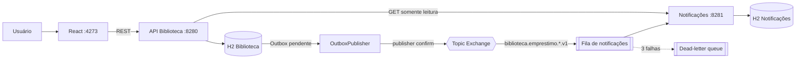
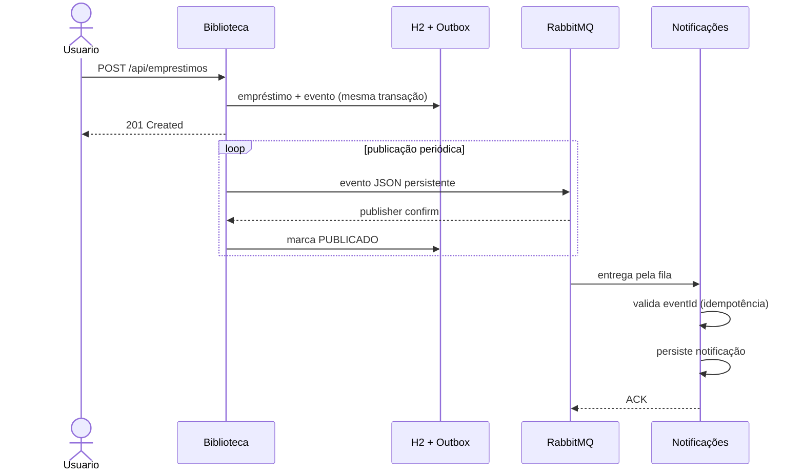

# Sistema de Biblioteca — TP4

Refatoração da aplicação de biblioteca para uma arquitetura orientada a eventos com Spring Boot, RabbitMQ e o padrão Transactional Outbox.

## Resultado da refatoração

No TP3, `EmprestimoService` chamava o serviço de notificações por OpenFeign dentro da mesma operação. Assim, uma indisponibilidade em Notificações podia impedir ou atrasar o empréstimo. No TP4, a transação grava o empréstimo e seu evento na mesma base local; um publicador assíncrono envia os eventos ao RabbitMQ e o microsserviço de notificações os consome de forma idempotente.

A consulta de notificações permanece HTTP síncrona por ser uma leitura iniciada pelo usuário. A escrita, que antes criava acoplamento temporal, passou a ser assíncrona.

## Arquitetura



### Fluxo de eventos



Se o RabbitMQ estiver indisponível, o evento permanece `PENDENTE` na tabela `event_outbox`. Quando o broker retorna, o agendador tenta novamente. Se o consumidor falhar três vezes, a mensagem é rejeitada e roteada para `notificacoes.emprestimos.dlq.v1`.

## Padrões de mensagens implementados

| Padrão | Implementação | Caso de uso |
| --- | --- | --- |
| Publish/subscribe | `TopicExchange biblioteca.eventos.v1` e routing keys versionadas | Permite adicionar novos consumidores sem alterar a Biblioteca. |
| Fila de trabalho | Fila durável `notificacoes.emprestimos.v1` | Uma instância disponível processa cada mensagem; novas instâncias competem pela carga. |
| Transactional Outbox | Entidade `OutboxEvent` gravada na transação do empréstimo | Evita perder o evento entre o commit do banco e a publicação. |
| Retry + Dead Letter | 3 tentativas com backoff e DLX/DLQ | Isola mensagens inválidas sem bloquear a fila principal. |
| Consumidor idempotente | `eventId` único em Notificação | Uma reentrega não cria notificação duplicada. |
| Request/response | OpenFeign somente no GET de notificações | Retorna imediatamente uma consulta solicitada pelo frontend. |

### Contrato dos eventos

Routing keys:

- `biblioteca.emprestimo.registrado.v1`
- `biblioteca.emprestimo.devolvido.v1`
- binding do consumidor: `biblioteca.emprestimo.*.v1`

Envelope JSON comum:

```json
{
  "eventId": "UUID",
  "eventType": "EMPRESTIMO_REGISTRADO",
  "eventVersion": 1,
  "occurredAt": "2026-09-26T16:55:26Z",
  "emprestimoId": 1,
  "leitorId": 3,
  "leitorNome": "Ada Eventos",
  "livroId": 4,
  "livroTitulo": "Arquitetura Orientada a Eventos",
  "dataPrevistaDevolucao": "2026-10-30",
  "dataDevolucao": null
}
```

O nome da routing key e `eventVersion` explicitam a versão do contrato. As mensagens e filas são duráveis; as mensagens são publicadas como persistentes.

## Spring Boot e RabbitMQ

A implementação usa as abstrações `spring-boot-starter-amqp`, `RabbitTemplate`, `@RabbitListener`, `TopicExchange`, `Queue`, `BindingBuilder`, propriedades `spring.rabbitmq.*` e `@Scheduled`. O Spring declara exchanges, filas e bindings e gerencia serialização, conexão, retry, ACK e ciclo de vida do listener.

## Prós e contras

### Vantagens

- Remove o acoplamento temporal: a Biblioteca funciona mesmo com Notificações fora do ar.
- Absorve picos com a fila e permite escalar consumidores horizontalmente.
- Novos consumidores podem reagir aos mesmos eventos sem alterar o produtor.
- Retry, DLQ, Outbox e idempotência tornam falhas recuperáveis e auditáveis.
- Cada serviço mantém seu banco e suas responsabilidades.

### Desvantagens e mitigação

- Consistência eventual: a notificação pode levar alguns segundos; a interface deve aceitar esse atraso.
- Mais infraestrutura e operação: RabbitMQ, filas, métricas e DLQ precisam ser monitorados.
- Depuração distribuída é mais complexa; `eventId` e logs correlacionados ajudam no rastreio.
- Contratos evoluem de forma independente; por isso routing keys e payload usam versão.
- Entrega é pelo menos uma vez; por isso o consumidor verifica o `eventId`.
- A Outbox cresce; em produção deve existir retenção/limpeza de eventos publicados.

É mais vantajosa em integrações assíncronas, picos de carga, processos longos, múltiplos consumidores e cenários em que o produtor não pode depender da disponibilidade imediata do consumidor. Para operações simples que exigem resposta imediata e forte consistência entre poucos componentes, REST síncrono pode ser mais simples.

## Estrutura relevante

```text
backend/
  config/RabbitMqConfig.java
  event/EmprestimoEvent.java
  event/OutboxEvent.java
  event/OutboxPublisher.java
  event/OutboxService.java
notificacoes-service/
  config/RabbitMqConfig.java
  event/EmprestimoEvent.java
  event/EmprestimoEventListener.java
  service/NotificacaoService.java
docker-compose.yml
```

## Execução

Requisitos: Docker e Docker Compose.

```bash
docker compose up --build
```

| Componente | Endereço |
| --- | --- |
| Frontend | http://localhost:4273 |
| API Biblioteca | http://localhost:8280 |
| API Notificações | http://localhost:8281 |
| RabbitMQ Management | http://localhost:15672 (biblioteca / biblioteca) |

As portas 4273, 8280 e 8281 evitam conflito com a versão TP3, que pode continuar executando em 4173, 8180 e 8181.

## Testes

```bash
cd backend && mvn test
cd ../notificacoes-service && mvn test
docker compose config
```

Resultado validado em 26/09/2026:

- backend: 6 testes, 0 falhas;
- notificações: 3 testes, 0 falhas;
- fluxo real: empréstimo e devolução produziram duas notificações;
- resiliência: com RabbitMQ parado, o empréstimo retornou sucesso e a notificação apareceu após a recuperação;
- fila principal e DLQ declaradas como duráveis, com um consumidor ativo e mensagens processadas.

## Rubrica — evidências

| Critério | Evidência |
| --- | --- |
| Prós e contras | Seção “Prós e contras”. |
| Diferentes padrões | Tabela “Padrões de mensagens implementados”. |
| RabbitMQ | Exchange, filas, bindings, retry, DLX/DLQ e Compose. |
| Abstrações Spring Boot | `RabbitTemplate`, `@RabbitListener`, Beans AMQP e propriedades. |
| Refatoração do acoplamento | POST OpenFeign removido; escrita via eventos e leitura HTTP preservada. |
| Código-fonte | Três aplicações e infraestrutura no repositório. |
| Git | Alterações do TP4 versionadas no repositório. |
| Diagramas | Diagramas de arquitetura e sequência neste documento. |
| Apresentação prática | Roteiro e cenários validados, prontos para gravação. |
